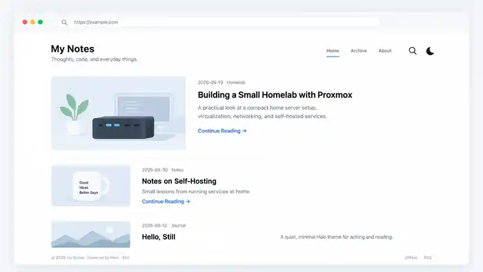

# Still for Halo

A clean and minimal theme for Halo.

Still for Halo focuses on readable typography, a simple article list, restrained visual styling, and a comfortable technical-blog reading experience.

## Preview

> Preview content is illustrative only. The public theme does not bundle demo posts, demo cover images, or personal branding.

## Features

- Minimal responsive homepage
- Larger first article card on the homepage
- Optional avatar
- Halo primary menu support
- Dark mode toggle
- Search Widget integration when the plugin is available
- Article cover support
- Clean Markdown typography
- Full-width Markdown tables
- Dark code blocks with syntax highlighting support
- Archives, categories, tags, authors, pages, and posts
- Halo comments
- Chinese and English UI strings

## Requirements

- Halo `>= 2.24.0`

## Installation

1. Download the release ZIP.
2. Open Halo Console.
3. Go to **Themes → Theme Management → Install**.
4. Upload the ZIP.
5. Activate **Still for Halo**.

## Theme Settings

The theme includes only a few optional settings:

- Avatar
- Homepage introduction
- Footer text
- Accent color
- Show / hide post excerpts

No personal avatar, demo cover, site title, or preset blog content is bundled in the public release.

## Recommended Halo Setup

For the cleanest homepage:

- Set a cover image on posts you want to display visually.
- Pin one article if you want it to appear as the main featured article.
- Configure a Halo primary menu for full control over navigation.
- Install Halo Search Widget if you want the search button to appear.

## License

MIT

## Repository

Source: https://github.com/lfscqk67/halo-theme-still

Issues: https://github.com/lfscqk67/halo-theme-still/issues
